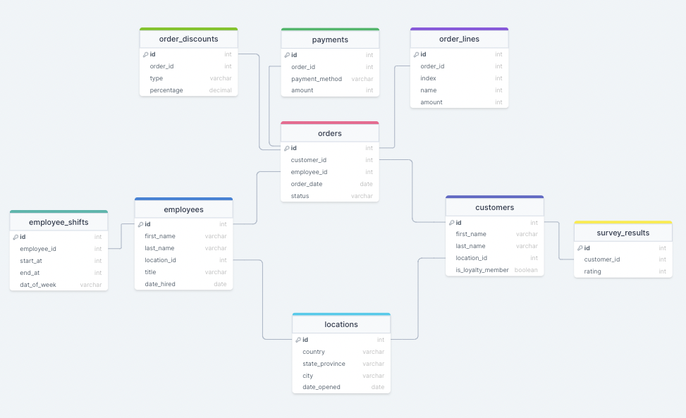

# QUERY; the daily SQL video game 

This dbt project is an open source glimpse into the inner workings of the QUERY; video game. This repo contains all previous queries used from the game within the [daily_queries](https://github.com/Cedar-Cat-Studios/dbt_query_game/tree/main/models/daily_queries) folder. Other queries used in the background can be found and explored within the [background_queries](https://github.com/Cedar-Cat-Studios/dbt_query_game/tree/main/models/background_queries) folder. In addition to providing more insight into the QUERY; game, this project is designed for the community to engage with the developer and contribute to the games codebase!

## 🎮 Play the Game

QUERY; is currently only available to play on MacOS. You can download the game and play using the [Apple App Store](https://apps.apple.com/us/app/query/id1636590940?mt=12). Be sure to come back each day to test your sql strength!

## 🎥 Watch the Launch Presentation
QUERY; was officially launched on 10/16/2022. The release took place following a presentation at dbt Labs' 2022 Coalesce conference. If you missed the QUERY; launch presentation you can catch the recording [here](https://www.youtube.com/watch?v=gzr4CbeVY5s).

## 😻 Contribute to the Game
The QUERY; game was developed for the community to allow players to strengthen, build, and develop their sql skills while having fun. As the game was designed with the community in mind, this repo is intended to be used for players to contribute their own queries to the game and have a chance to be featured as a daily query in the game! Sound like fun? Here is how you can contribute:

### Step 1: Seed the Schema
This project contains all the relevant seed data (shout out to the OG Jaffle Shop dataset) used within the QUERY; game. You can either install the project as a dbt package, or fork this dbt project (be sure to have [dbt installed](https://docs.getdbt.com/dbt-cli/install/overview)) and seed the data into your respective warehouse.

If you choose to install this project as a dbt package, you can simply include the following in your `packages.yml` within your root dbt project:
```yml
packages:
  - git: https://github.com/Cedar-Cat-Studios/dbt_query_game.git
    revision: main
    warn-unpinned: false
```

Once you have the project installed or forked you may simply seed the data with the following command:
```zsh
dbt seed -s +dbt_query_game
```

>**Note**: you can use the below linked image for a quick view of the Jaffle Shop ERD used in QUERY;
[](https://drawsql.app/teams/cedar-cat-studios/diagrams/jaffle-shop)

### Step 2: Explore the Data
Now that the data used for QUERY; is in your warehouse, you can explore as much as you like. I challenge you to come up with a question (ideally one a friendly neighborhood stakeholder would ask) and answer the question with your own query.

### Step 3: Generate Your Query
Once you have a question and query, you may take the next step in contributing your query. Before you may proceed, you must create a fork of this project. Once you have a forked version of this project, you can and add your question/query to the [community_queries](https://github.com/Cedar-Cat-Studios/dbt_query_game/tree/main/models/community_queries) folder as a `.sql` file with the naming convention of `<github username>_<number of PRs you have opened on this repo>.sql` (your first file name should end with `_1`). The contents of your `.sql` file should follow the format outlined below:

```sql
-- What is our best all time selling item?
select 
    name,
    count(id) as total_units
from {{ ref('order_lines') }}
group by 1
order by total_units desc
limit 1
```

>**Note**: You will want to include the question as a comment at the top, and the query below which answers the question.

### Step 4: Submit a PR
With your `.sql` file added to your fork, you can open the PR against this repo! Be sure to follow the prompts when completing the PR and continue playing to see if your query is featured in the game! If your query is featured, your PR will be lightly edited by moving your contribution to the [daily_queries](https://github.com/Cedar-Cat-Studios/dbt_query_game/tree/main/models/daily_queries) folder and merged into the QUERY; codebase!

## 💝 Support the Dev
[@JoeMark17](https://github.com/JoeMark17) is the sole developer of the QUERY; game. All queries run within the QUERY; game are executed and billed against a BigQuery project maintained by the individual developer. If you would like to support the developer's efforts to keep the QUERY; game (and the BigQuery project) funded, then you can [sponsor this repo](https://github.com/sponsors/JoeMark17). Any and all support is greatly appreciated!

## 🎉 Help Improve the Game
QUERY; is continually maintained and iterated upon by the developer. If you would like to suggest new features or raise bugs, you can do so within the [Issues](https://github.com/Cedar-Cat-Studios/dbt_query_game/issues) section of this repository.
